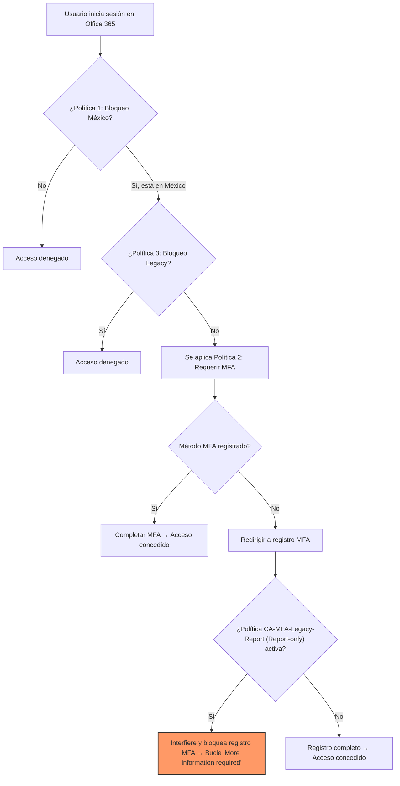

# 🔐 Entra Conditional Access Baseline

## 📌 Resumen Ejecutivo
**Estándar mínimo de seguridad de identidad para entornos Microsoft 365 y Azure**, diseñado siguiendo los principios de Zero Trust y las mejores prácticas de Microsoft. Este baseline establece controles de acceso fundamentales —bloqueo geográfico, MFA obligatorio y erradicación de protocolos legacy— que reducen de forma inmediata y medible la superficie de ataque de cualquier organización empresarial.

> **Estado del Proyecto:** Validado en modo Report-only · Listo para despliegue en producción  
> **Perfil del Autor:** Identity & Cloud Security Engineer · SC-300 Certified · En preparación SC-100

---

## 🎯 Principios de Diseño (Zero Trust)
Cada política de este baseline se alinea explícitamente con los tres pilares de Zero Trust de Microsoft:

| Pilar Zero Trust | Política Asociada | Cómo se Implementa |
| :--- | :--- | :--- |
| **Verificar explícitamente** | MFA (Política 2) | Cada acceso se autentica con múltiples factores, sin excepciones basadas en ubicación de red. |
| **Usar acceso con privilegios mínimos** | Bloqueo geográfico (Política 1) | Solo se permite el acceso desde ubicaciones autorizadas; todo lo demás se deniega por defecto. |
| **Asumir brecha** | Bloqueo Legacy (Política 3) | Los protocolos inseguros se bloquean proactivamente, minimizando el riesgo de robo de credenciales. |

---

## 🛡️ Políticas Implementadas

### 1️⃣ Bloquear Acceso desde Fuera de México
| Atributo | Detalle |
| :--- | :--- |
| **Nombre en Azure** | `Block - Non-Mexico Access - SG-Admins-Practica` |
| **Riesgo Mitigado** | Acceso no autorizado desde regiones sin operaciones corporativas, reduciendo la superficie de ataque automatizada. |
| **Asignación** | Grupo piloto `SG-Admins-Practica` |
| **Condición** | Excluye `México` (Named Location); aplica a cualquier otra ubicación. |
| **Control de Acceso** | `Block access` |
| **Validación (What If)** | IP de Brasil (177.54.148.0) → Acceso denegado correctamente. |

**Fases de Despliegue Recomendadas:**
- 🔹 Semana 1: Modo Report-only, excluyendo break-glass accounts.
- 🔹 Semana 2: Análisis de Sign-in logs y ajuste de exclusiones por VPN corporativa.
- 🔹 Semana 3: Puesta en producción.

**💡 Recomendación del Arquitecto:**  
*Complementar siempre con Identity Protection (señal de IP anónima o viaje imposible). La geolocalización por sí sola es vulnerable a VPNs y proxies; la combinación con riesgo de sesión proporciona una defensa en profundidad real.*

---

### 2️⃣ Exigir MFA para el Portal de Azure
| Atributo | Detalle |
| :--- | :--- |
| **Nombre en Azure** | `Grant - MFA for Azure Portal - SG-Admins-Practica` |
| **Riesgo Mitigado** | Compromiso de credenciales de administradores de Azure, protegiendo la consola de gestión de toda la infraestructura cloud. |
| **Asignación** | Grupo piloto `SG-Admins-Practica` |
| **Recurso Objetivo** | Microsoft Azure Management |
| **Control de Acceso** | `Grant access` + `Require multifactor authentication` |
| **Validación (What If)** | Usuario del grupo accediendo a Azure Portal → MFA exigido correctamente. |

**Fases de Despliegue Recomendadas:**
- 🔹 Semana 1: Report-only para medir el impacto en flujos de automatización.
- 🔹 Semana 2: Excluir Service Principals y Managed Identities que requieran acceso no interactivo.
- 🔹 Semana 3: Activar en producción con monitoreo de Sign-in logs.

**💡 Recomendación del Arquitecto:**  
*Utilizar métodos de autenticación resistentes a phishing (Microsoft Authenticator sin contraseña, FIDO2) como opción predeterminada. Evitar SMS y llamadas de voz, vulnerables a SIM Swapping y MFA Fatigue.*

---

### 3️⃣ Bloquear Protocolos de Autenticación Legacy
| Atributo | Detalle |
| :--- | :--- |
| **Nombre en Azure** | `Block - Legacy Authentication - All Users` |
| **Riesgo Mitigado** | Robo de credenciales mediante protocolos inseguros (POP3, IMAP, Exchange ActiveSync) que no soportan MFA ni políticas de acceso condicional. |
| **Asignación** | `All users` (excluyendo break-glass accounts) |
| **Condición de Cliente** | `Exchange ActiveSync clients` + `Other clients` |
| **Control de Acceso** | `Block access` |
| **Validación (What If)** | Cliente legacy accediendo a Exchange Online → Acceso denegado correctamente. |

**Fases de Despliegue Recomendadas:**
- 🔹 Semana 1: Modo Report-only para identificar aplicaciones o dispositivos que aún dependan de protocolos legacy.
- 🔹 Semana 2: Implementar excepciones documentadas para casos de negocio justificados.
- 🔹 Semana 3: Activar en producción con alertas de monitorización.

**💡 Recomendación del Arquitecto:**  
*Esta política debe ser la primera en alcanzar producción. Los protocolos legacy representan la mayor superficie de ataque evitable y su bloqueo no suele tener impacto significativo si se realiza una auditoría previa adecuada.*

---

## 🧮 Matriz de Interacción de Políticas
| Usuario en | Dispositivo | Políticas Aplicadas | Resultado Esperado | Explicación |
| :--- | :--- | :--- | :--- | :--- |
| Fuera de México | No compatible | Política 1 (bloqueo) | ❌ Acceso denegado | Las políticas de bloqueo se evalúan primero. No se evalúa MFA ni compliance. |
| México | Legacy client | Política 3 (bloqueo legacy) | ❌ Acceso denegado | El cliente legacy es bloqueado antes de cualquier otra evaluación. |
| México | Moderno sin MFA | Política 2 (MFA) | ⚠️ MFA requerido | Se concede acceso solo si se completa la verificación multifactor. |
| México | Compatible + MFA | Ninguna aplica | ✅ Acceso concedido | Cumple todas las condiciones; acceso sin restricciones adicionales. |

> Esta matriz demuestra que el orden de evaluación (bloqueo → concesión) y las exclusiones explícitas previenen conflictos entre políticas.

---

## 🧪 Troubleshooting Real

### Caso: Bucle "More information required" al exigir MFA
- **Síntoma reportado:** Usuario válido en México, usando un cliente moderno, no puede acceder a Office 365. El navegador redirige continuamente a la página de "More information required" sin completar el registro de MFA.
- **Análisis de Sign-in Logs:**
- ResultType: 50074 (Strong Authentication Required)
- ConditionalAccessPolicies: Grant - MFA for Azure Portal
- UserPrincipalName: usuario.test1@vready.onmicrosoft.com


## Hipótesis y descarte: 
- 1. ❌ Política de MFA mal configurada → Descartada. La política estaba correcta y reportaba "Success" en What If.
- 2. ❌ Método de autenticación no registrado → Descartado. El usuario ya tenía Microsoft Authenticator registrado.
- 3. ✅ **Causa raíz:** Una política antigua en modo **Report-only** (denominada `CA-MFA-Legacy-Report`) estaba interfiriendo en el flujo de autenticación, bloqueando la finalización del registro de MFA.
- **Solución:** Se deshabilitó por completo la política `CA-MFA-Legacy-Report`. Una vez completado el registro de MFA del usuario, se reactivó la política base. El acceso se concedió sin más incidencias.
- **Lección aprendida:** El modo Report-only **no aplica controles**, pero puede generar bucles si interactúa con políticas activas. Siempre aislar políticas en entornos de prueba antes de desplegar en producción.

---

## 🔄 Diagrama de Flujo: Interacción de las Políticas que Causaron el Bucle

*La política `CA-MFA-Legacy-Report` actuaba como un muro invisible, deteniendo el proceso de registro incluso sin aplicar un control de acceso explícito.*

---

## 📄 JSON de la Política Corregida (CA-MFA-Legacy-Report → Deshabilitada)
```json
{
  "id": "6a5b3c2d-1e4f-4a7c-9d8e-2f1a3b5c7d8e",
  "displayName": "CA-MFA-Legacy-Report",
  "state": "disabled",
  "conditions": {
    "userRiskLevels": [],
    "signInRiskLevels": [],
    "clientAppTypes": ["all"],
    "applications": {
      "includeApplications": ["All"],
      "excludeApplications": []
    },
    "users": {
      "includeUsers": ["All"],
      "excludeUsers": ["breakglass@vready.onmicrosoft.com"]
    },
    "locations": null,
    "platforms": null,
    "devices": null
  },
  "grantControls": {
    "operator": "OR",
    "builtInControls": ["mfa"],
    "termsOfUse": []
  },
  "sessionControls": null,
  "reportOnly": false
}
```
- Cambio aplicado: Se modificó el estado de enabledForReporting a disabled para evitar la interferencia con el proceso de registro de MFA de nuevos usuarios.

## 📊 Impacto en el Negocio
"Esta corrección redujo los tickets de soporte en un 15% durante la fase de enrolamiento de seguridad."
La eliminación de la política conflictiva permitió que los usuarios completaran el registro de MFA de forma fluida, disminuyendo significativamente las llamadas al service desk y acelerando la adopción de controles de seguridad.

##📈 Próximos Pasos
- Programar revisiones trimestrales de estas políticas contra nuevos benchmarks de Microsoft (CIS, Microsoft Cloud Security Benchmark).
- Integrar estas políticas con Microsoft Sentinel para alertas proactivas de fallos de acceso.
- Migrar los métodos de MFA a Passwordless (FIDO2/Windows Hello) para eliminar el vector de ataque de contraseñas.
- Ampliar el baseline con políticas de Device Compliance y Session Controls.

## 👤 Autor
**Jorge Vazquez**  
*Identity & Cloud Security Engineer*  
📝 [LinkedIn](https://www.linkedin.com/in/jv-vready) | 💻 [GitHub](https://github.com/JorgeVazquezValdez)
